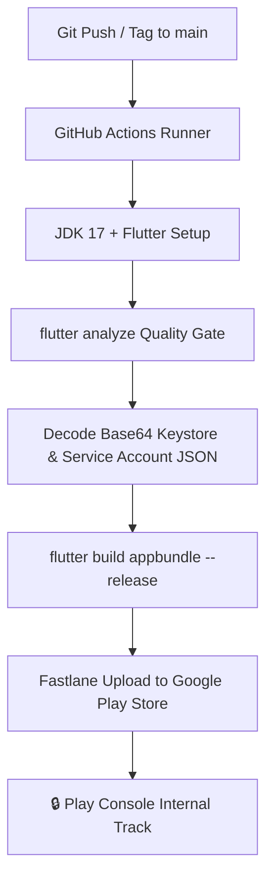

# WatchHive Mobile 🎬

A premium Flutter mobile app for **WatchHive** — Track Movies, TV Series, Anime, & K-Dramas, compare cinematic rankings with friends, and discover AI insights via **MindLens AI**.

---

## 🎨 Design System & Aesthetics
- **Theme**: Warm Honey Cream (matching Web PWA)
- **Primary Color**: Honey Gold (`#FFB700`)
- **Background**: Warm Cream (`#FFF9F0`)
- **Typography**: Inter / Manrope

---

## 🛠️ Getting Started

### 1. Prerequisites

Make sure Flutter and Java JDK 17 are installed on your environment:

```bash
# Install Flutter (macOS)
brew install --cask flutter

# Install Java JDK 17
brew install --cask temurin@17

# Verify environment readiness
flutter doctor
```

### 2. Clone & Install Dependencies

```bash
cd /Users/adityadasamantharao/Documents/Repos/watchhive_mobile

# Install Flutter packages
flutter pub get
```

### 3. Environment Configuration

Create a `.env` file in the root of the project:

```env
WATCHHIVE_API_URL=https://watchhive-api-production.up.railway.app/api/v1
TMDB_IMAGE_BASE_URL=https://image.tmdb.org/t/p/w500
GOOGLE_WEB_CLIENT_ID=your_google_web_client_id
```

### 4. Running Locally

```bash
# Run on Android Emulator
flutter run -d emulator-5554

# Run on iOS Simulator
flutter run -d "iPhone 15"

# Run Static Code Analysis (0 Error Target)
flutter analyze
```

---

## 🚀 CI/CD & Google Play Store Deployment Pipeline

WatchHive Mobile features an automated **GitHub Actions + Fastlane** CI/CD pipeline. Every push to `main` branch or release tag (`v*.*.*`) automatically compiles, signs, and publishes the Android App Bundle (`.aab`) to the **Google Play Store (Internal Track)**.

### Pipeline Architecture Workflow



### GitHub Repository Secrets Setup

To enable automated Play Store builds, configure these 5 secrets under **GitHub Repo > Settings > Secrets and variables > Actions**:

| Secret Name | Value Description |
| :--- | :--- |
| `ANDROID_KEYSTORE_BASE64` | Base64 string of `upload-keystore.jks` (`base64 -i android/app/upload-keystore.jks \| tr -d '\n'`) |
| `ANDROID_KEYSTORE_PASSWORD` | Keystore password |
| `ANDROID_KEY_ALIAS` | Key alias name (e.g., `watchhive_upload_key`) |
| `ANDROID_KEY_PASSWORD` | Key alias password |
| `PLAY_STORE_JSON_KEY_BASE64` | Base64 string of Google Play Service Account JSON key |

### Local Release Build (Manual)

To build a signed Android App Bundle locally for manual testing:

```bash
# Create android/key.properties from android/key.properties.example
cp android/key.properties.example android/key.properties

# Build Release App Bundle (.aab)
flutter build appbundle --release

# Output path: build/app/outputs/bundle/release/app-release.aab
```

### Fastlane Command Lanes

If Fastlane is installed locally (`gem install fastlane` inside `android/`):

```bash
cd android
fastlane internal              # Deploy to Google Play Internal Testing Track
fastlane beta                  # Deploy to Open Beta Track
fastlane promote_to_production # Promote internal build to Production
```

---

## 📁 Project Structure

```
lib/
├── main.dart                  # Entry point
├── app.dart                   # Root MaterialApp configuration
├── core/
│   ├── api/                   # Dio HTTP client + endpoint constants
│   ├── auth/                  # JWT token storage & session manager
│   ├── theme/                 # AppColors + AppTheme design tokens
│   └── router/                # GoRouter route guards & navigation
├── features/
│   ├── auth/                  # Login, Signup, Splash, Forgot Password
│   ├── feed/                  # Social feed & recommended cards
│   ├── entries/               # Watch hub (Watching, History, Watchlist, Suggestions)
│   ├── mindlens/              # MindLens AI analytics & recommendation velocity
│   ├── search/                # TMDB media search & user search
│   ├── profile/               # Profiles, Cinematic Stacks, & Taste Comparison
│   └── notifications/         # Activity notifications
└── shared/
    ├── models/                # User, Entry, MediaResult, Suggestion
    └── widgets/               # Reusable UI components & avatars
```

---

## 📜 License
Copyright © 2026 WatchHive. All rights reserved.
